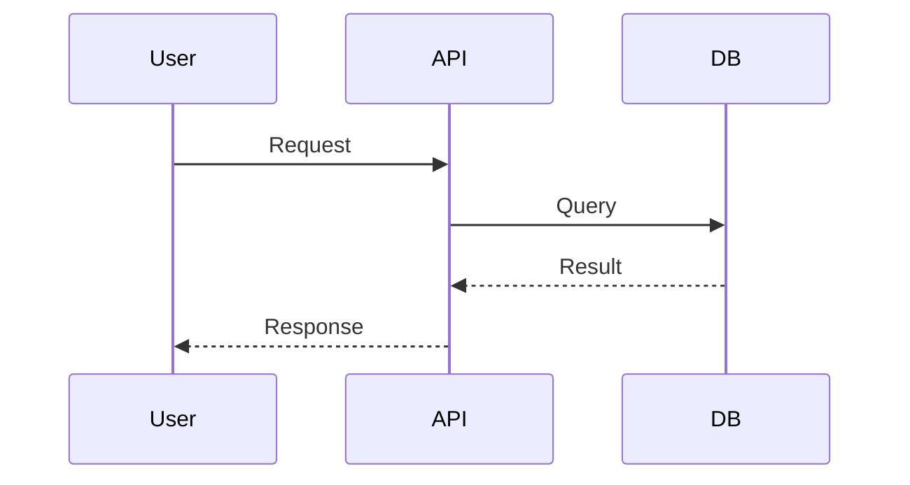
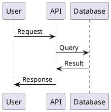

# Diagram Generation

Guide to creating diagrams as code using PlantUML, Mermaid, and other tools.

## Mermaid (GitHub-native)

```markdown



```

## PlantUML



## Best Practices

✅ Version control diagrams as code
✅ Use consistent notation
✅ Keep diagrams simple
✅ Auto-generate images in CI

---

**Related Resources:**
- technical-writing-guide.md - When to use diagrams
